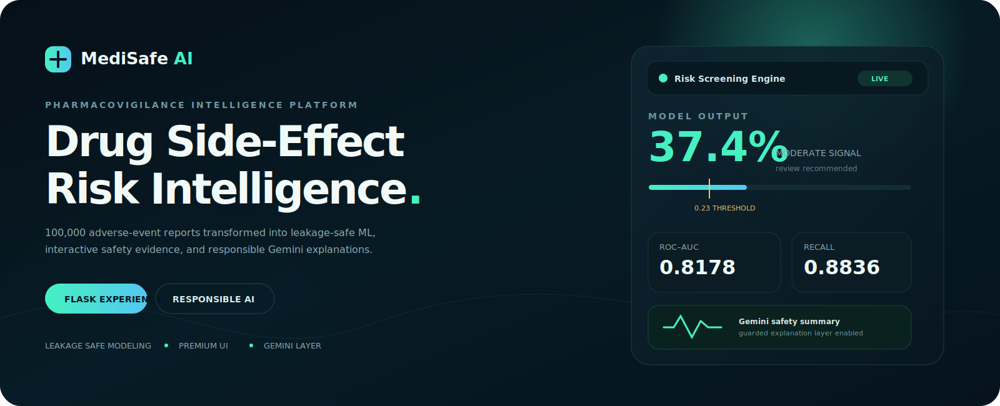
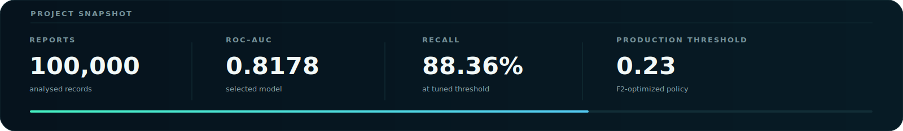
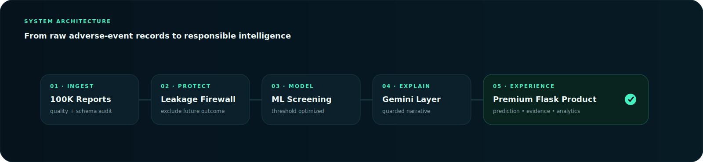
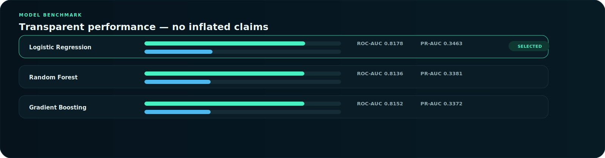

<p align="center">
  
</p>

<p align="center">
  <a href="#-launch-the-platform"></a>
  <a href="#-model-intelligence"></a>
  <a href="#-responsible-ai-layer"></a>
  <a href="#%EF%B8%8F-clinical-safety-boundary"></a>
</p>

<p align="center">
  <b>Premium adverse-event analytics platform for drug side-effect intelligence, report-level hospitalization-risk screening, and guarded AI explanations.</b>
</p>

<p align="center">
  <a href="#-platform-overview">Overview</a>&nbsp;&nbsp;•&nbsp;&nbsp;
  <a href="#-product-experience">Experience</a>&nbsp;&nbsp;•&nbsp;&nbsp;
  <a href="#-model-intelligence">Model</a>&nbsp;&nbsp;•&nbsp;&nbsp;
  <a href="#-repository-architecture">Architecture</a>&nbsp;&nbsp;•&nbsp;&nbsp;
  <a href="#-launch-the-platform">Run Locally</a>
</p>

---

<p align="center">
  
</p>

## ✦ Platform Overview

**MediSafe AI** turns a 100,000-record drug side-effect dataset into a polished, product-style pharmacovigilance experience. It combines deep exploratory analysis, leakage-safe machine learning, an animated Flask interface, a side-effect evidence lab, and Gemini-powered explanations constrained by medical-safety guardrails.

<table>
<tr>
<td width="33%" valign="top">

### Evidence Intelligence
Explore medicine-level report volume, severity patterns, hospitalization signals, observed side-effects and contextual risk patterns.

</td>
<td width="33%" valign="top">

### Risk Screening Engine
Estimate report-level hospitalization risk using a production-style pipeline that avoids post-event target leakage.

</td>
<td width="33%" valign="top">

### Responsible AI Layer
Translate analytical output into readable explanations without prescribing, diagnosing or replacing clinical judgement.

</td>
</tr>
</table>

> [!CAUTION]
> **MediSafe AI is a portfolio analytics product, not a medical device.** It must not be used to diagnose illness, select treatment, recommend dosage, or start/stop medicine.

---

## ◈ Product Experience

### A premium application, not just notebooks

The Flask experience is designed as a clinical intelligence workspace rather than a plain prediction form:

| Experience Layer | Implementation |
|---|---|
| **Cinematic landing experience** | Animated medical particle network, gradient atmosphere, scanner motif and motion-led hero section. |
| **Focused Risk Mode** | Most influential model input groups appear first: severity, reported side-effect, medicine and chronic condition. |
| **Expandable Context** | Age, dosage, reporting delay, country, gender, smoking and alcohol-use context remain available to the full model. |
| **Dynamic Prediction View** | Animated risk dial, threshold marker, evidence profile and risk communication panel. |
| **Evidence Explorer** | Search reported side-effects and view dataset-backed medicine associations. |
| **Gemini Copilot** | Optional guarded explanation panel configured through `.env`, with strict no-prescription boundaries. |

### Product Modes

```text
01  Risk Screening        → report-level hospitalization risk estimate
02  Evidence Explorer     → medicine ↔ reported side-effect associations
03  Gemini Safety Layer   → plain-language, guarded analytics explanation
04  Transparency Panel    → model drivers, metrics and limitations
```

---

## ◇ System Architecture

<p align="center">
  
</p>

### Data-to-Product Pipeline

```text
Raw Adverse-Event Records
        ↓
Quality Profiling + Deep EDA
        ↓
Leakage Firewall + Feature Engineering
        ↓
Model Benchmarking + Threshold Policy
        ↓
Serialized Inference Pipeline
        ↓
Premium Flask UI + Gemini Explanation Layer
```

---

## ⟡ Dataset Intelligence

| Metric | Value |
|---|---:|
| Records analysed | **100,000** |
| Original variables | **16** |
| Medicines represented | **10** |
| Reported side-effect categories | **21** |
| Countries represented | **7** |
| Hospitalized reports | **10.31%** |
| Severe reports | **8.10%** |

### Analytical Dimensions

```text
Patient Context      → age, gender, country, chronic condition, smoker, alcohol use
Medication Evidence  → drug name, observed dosage
Adverse Event Signal → side-effect, severity
Temporal Context     → treatment start date, report date
Outcome Context      → hospitalized, outcome, recovery days
```

### Leakage Firewall

The project explicitly excludes variables that would make a production prediction misleading:

| Excluded from Production Model | Reason |
|---|---|
| `outcome` | Can reveal information only known after the adverse-event progression. |
| `recovery_days` | Post-event recovery information unavailable at initial screening. |
| `patient_id` | Identifier with no legitimate clinical predictive meaning. |

---

## ✧ Exploratory Analysis Suite

The EDA work is built to answer stakeholder-level safety questions, not merely produce charts.

### Investigation Themes

| Analytical Theme | Key Questions |
|---|---|
| **Safety Signal Landscape** | Which side-effects and severity groups dominate the reported data? |
| **Medicine Profiles** | Which medicines accumulate the largest report volume and the strongest severe/hospitalized patterns? |
| **Patient Context** | How do age groups, chronic conditions and behavioural factors relate to adverse-event outcomes? |
| **Risk Combinations** | Which medicine–side-effect–severity combinations deserve deeper monitoring? |
| **Temporal Review** | Are report patterns changing over time? |
| **Responsible Interpretation** | Which observations are associative only, and where must causality not be claimed? |

### Notebook

```text
notebooks/01_God_Level_EDA.ipynb
```

---

## ◎ Model Intelligence

<p align="center">
  
</p>

### Production Decision

| Item | Selected Strategy |
|---|---|
| Current shipped model | **Logistic Regression** |
| Prediction target | Report-level hospitalization flag |
| ROC-AUC | **0.8178** |
| PR-AUC | **0.3463** |
| Optimized threshold | **0.23** |
| Recall at optimized threshold | **0.8836** |
| F2 at optimized threshold | **0.5730** |

### Why a Recall-Sensitive Threshold?

This use case is framed as **risk screening**. In a screening workflow, missing a potentially elevated adverse-event report can be more costly than sending extra records for review. The project therefore demonstrates an **F2-oriented threshold policy**, placing more emphasis on recall than precision.

> This is an analytical policy demonstration, not clinical validation.

### Advanced Modeling Laboratory

The repository also includes an expanded model experimentation workflow:

```text
notebooks/02_Ultimate_Model_Optimization.ipynb
```

| Capability | Included Workflow |
|---|---|
| Model families | Logistic Regression, Random Forest, Extra Trees, LightGBM, XGBoost, CatBoost |
| Optimization | Optuna hyperparameter search framework |
| Evaluation | PR-AUC, ROC-AUC, precision, recall, F1, F2 and calibration |
| Reliability | Threshold tuning, locked-test design and subgroup checks |
| Explainability | Permutation importance and SHAP-ready extension |
| Deployment | Model bundle export for Flask inference |

---

## ◉ Responsible AI Layer

Gemini is integrated as an **analytics explanation assistant**, never as a treatment adviser.

### Allowed Responsibilities

- Summarize report-level risk output in simple language.
- Explain observed dataset patterns.
- Reinforce uncertainty and association-versus-causation boundaries.
- Encourage professional guidance for concerning symptoms.

### Prohibited Responsibilities

- Recommending a medicine or dosage.
- Telling a person to start, stop or switch treatment.
- Claiming a reported drug definitely caused an event.
- Replacing clinician or pharmacist evaluation.

### Secure API Configuration

The application reads Gemini credentials through environment configuration:

```env
GEMINI_API_KEY=PASTE_YOUR_KEY_HERE
GEMINI_MODEL=gemini-2.5-flash
FLASK_DEBUG=1
PORT=5000
```

> [!IMPORTANT]
> Keep your real `.env` file private. Do not commit API keys to GitHub. Commit only `.env.example`.

---

## ⛨ Clinical Safety Boundary

The side-effect explorer intentionally answers:

```text
"Which medicines appear with this reported side-effect in this dataset?"
```

It intentionally does **not** answer:

```text
"Which medicine should I take for fever, pain or nausea?"
```

| Responsible Dataset Output | Claim the App Avoids |
|---|---|
| “Nausea appears among reports involving Medicine X.” | “Medicine X treats nausea.” |
| “Matched records show an observed hospitalization percentage.” | “Medicine X is safe for you.” |
| “This is a potential signal for review.” | “Start or stop medication.” |

Adverse-event reporting can support safety monitoring; it cannot independently determine safe treatment for an individual.

---

## ⌘ Technology Stack

<p>
  
  
  
  
  
  
  
  
</p>

| Layer | Tools |
|---|---|
| Data Exploration | Pandas, NumPy, Matplotlib, Seaborn, Plotly |
| Machine Learning | Scikit-learn, LightGBM, XGBoost, CatBoost |
| Optimization & Explainability | Optuna, SHAP, permutation importance |
| Application | Flask, HTML, CSS, JavaScript, Chart.js |
| AI Integration | Google Gemini through `google-genai` |
| Deployment Configuration | Joblib, python-dotenv |

---

## ⌁ Repository Architecture

```text
MediSafe_AI_Premium_V3/
│
├── app/
│   ├── app.py                         # Flask routes, inference and Gemini layer
│   ├── recommender.py                 # Evidence explorer logic
│   ├── templates/
│   │   └── index.html                 # Premium single-page experience
│   └── static/
│       ├── css/
│       │   └── premium.css            # UI system, animation and glass panels
│       └── js/
│           └── premium.js             # Interactions, charts and motion effects
│
├── assets/
│   ├── eda_key_findings.json
│   └── readme/
│       ├── hero-banner.svg            # Premium GitHub header visual
│       ├── metrics-strip.svg          # Project KPI panel
│       ├── system-architecture.svg    # Architecture illustration
│       └── model-benchmark.svg        # Real model metric graphic
│
├── data/
│   └── drug_side_effects_100k_dataset.csv
│
├── models/
│   ├── hospitalization_risk_model.pkl
│   ├── model_metrics.json
│   └── drug_recommendation_knowledge.json
│
├── notebooks/
│   ├── 01_God_Level_EDA.ipynb
│   ├── 02_God_Level_Modeling.ipynb
│   ├── 02_Ultimate_Model_Optimization.ipynb
│   └── 03_God_Level_Recommendation_System.ipynb
│
├── .env.example
├── .gitignore
├── requirements.txt
└── README.md
```

---

## ▶ Launch the Platform

### 1. Clone and Enter the Repository

```bash
git clone <your-repository-url>
cd MediSafe_AI_Premium_V3
```

### 2. Create the Environment

<details>
<summary><b>Windows PowerShell</b></summary>

```powershell
python -m venv .venv
.\.venv\Scripts\Activate.ps1
pip install -r requirements.txt
Copy-Item .env.example .env
```

</details>

<details>
<summary><b>macOS / Linux</b></summary>

```bash
python3 -m venv .venv
source .venv/bin/activate
pip install -r requirements.txt
cp .env.example .env
```

</details>

### 3. Add Gemini Key

Open `.env`, add your key, and save the file:

```env
GEMINI_API_KEY=PASTE_YOUR_KEY_HERE
GEMINI_MODEL=gemini-2.5-flash
```

### 4. Start Flask

```bash
cd app
python app.py
```

Open the local browser address printed by Flask:

```text
http://127.0.0.1:5000
```

---

## ⌗ API Surface

| Method | Endpoint | Purpose |
|---|---|---|
| `GET` | `/health` | Confirms application, model and Gemini readiness. |
| `POST` | `/api/predict` | Returns report-level hospitalization-risk analytics. |
| `POST` | `/api/side-effect-explorer` | Returns dataset-backed side-effect associations. |

### Prediction Request Example

```json
{
  "age": 52,
  "gender": "Female",
  "country": "India",
  "drug_name": "Paracetamol",
  "dosage_mg": 500,
  "side_effect": "Nausea",
  "severity": "Moderate",
  "chronic_condition": "Hypertension",
  "smoker": "No",
  "alcohol_use": "Occasional",
  "days_to_report": 14
}
```

---

## ↗ Roadmap

- [ ] Add live SHAP explanation cards inside the Flask result panel.
- [ ] Introduce authenticated review workspace for analysts.
- [ ] Add trend dashboards filtered by medicine, severity and geography.
- [ ] Create downloadable adverse-event analytical reports.
- [ ] Implement prediction logging, model versioning and drift monitoring.
- [ ] Secure cloud deployment using managed secret storage.
- [ ] Validate only with medically governed data before operational use.

---

## ⚠ Medical & Ethical Disclaimer

**MediSafe AI is an educational and portfolio-grade data science project.** It is not approved for clinical decision making, diagnosis, prescribing, dosage guidance or treatment decisions. The application identifies patterns within adverse-event reports and cannot establish that a medicine caused a reported outcome or that a medicine is appropriate for a specific person.

For medication or side-effect questions, consult a qualified clinician or pharmacist. For urgent or severe symptoms, seek immediate medical care.

---

<p align="center">
  
</p>

<p align="center">
  <b>Designed as a premium analytics product. Built with transparent modeling. Guarded by responsible AI principles.</b>
</p>
